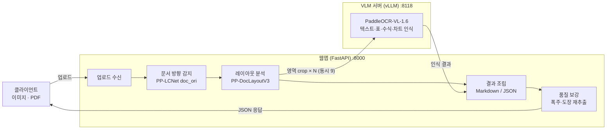
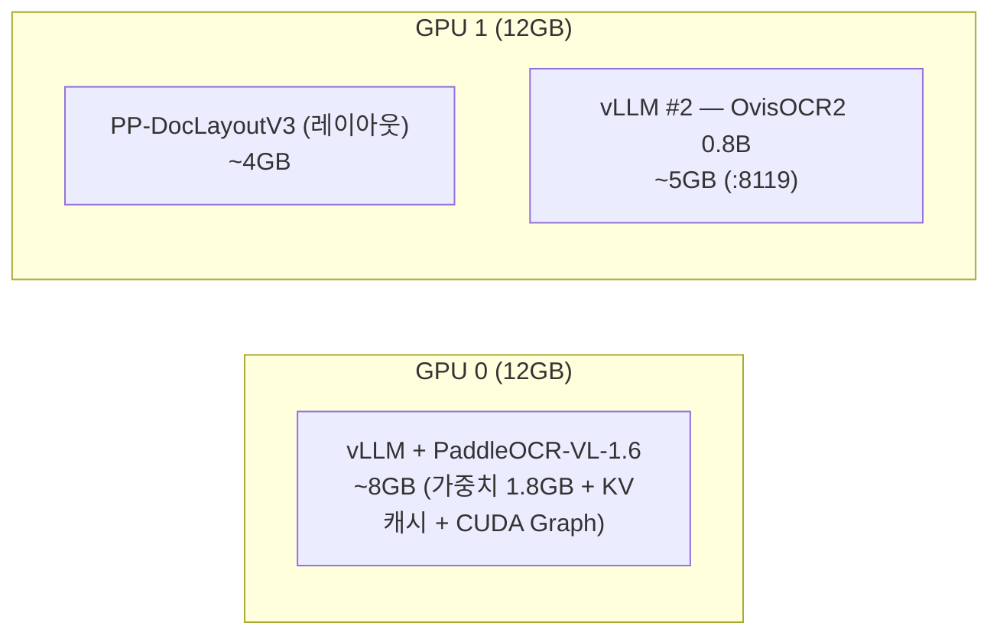

# 아키텍처

## 2단계 파이프라인

단일 OCR이 아니라 **레이아웃 분석 → 영역별 VLM 인식** 파이프라인이다.

| 구성 | 역할 | 모델 |
|---|---|---|
| 방향 감지 | 페이지 회전(0/90/180/270°) 분류·보정 | PP-LCNet_x1_0_doc_ori |
| 레이아웃 분석 | 영역(제목/문단/표/그림/수식) 위치·읽는 순서 | PP-DocLayoutV3 |
| 영역 인식 | 각 영역의 실제 내용 판독 | **PaddleOCR-VL-1.6 (0.9B VLM)**, vLLM 서빙 |

## 요청 처리 모델

- **페이지 간 순차, 페이지 내 영역 병렬** (기본 동시 9영역) — 총 시간 ≈ 쪽수 × 쪽당 시간
- 추출 요청은 서버에서 **1건씩 직렬 처리** (파이프라인 락). 동시 업로드는 자동 큐잉 — 응답의 `elapsed_sec` 은 대기 제외 순수 처리시간
- 추출은 threadpool 에서 실행되어 **처리 중에도** `/api/health`·웹 UI 는 즉시 응답 (논블로킹)

## GPU 배치

- **한 모델을 쪼개는 텐서 병렬(TP)이 아니라 역할 분담**이다. 모델이 작아(0.9B) TP는 통신 오버헤드로 오히려 손해 — 단일 GPU 서빙 + 단계 분리가 최적
- 같은 GPU에 paddle(레이아웃)과 torch(vLLM)를 함께 올리면 간섭 소지가 있어 분리를 권장 (`LAYOUT_DEVICE=gpu:1`)

## 듀얼 엔진: PaddleOCR-VL vs OvisOCR2

`model` 파라미터로 두 엔진 중 하나를 선택한다 (기본 `paddle`).

| | **PaddleOCR-VL-1.6** (기본) | **OvisOCR2** |
|---|---|---|
| 방식 | 2단계 파이프라인 (레이아웃 → 영역별 VLM) | **end-to-end** (페이지 통째 → markdown) |
| 크기 | 0.9B VLM + 레이아웃 모델 | 0.8B (학습 시 4B 브랜치 활용) |
| 벤치마크 | OmniDocBench 상위권 | **OmniDocBench v1.6 96.58 (SOTA)**, PureDocBench Avg3 75.06 |
| 강점 | 영역 좌표(json) 제공, 도장 제거·폭주 재시도 등 보정 파이프라인 | 레이아웃 분할 한계 없음 — 표 밖 부속 박스(합계 등)도 자연스럽게 포함, 밀집 문서에서 더 빠름 |
| 약점 | 레이아웃이 영역을 잘못 나누면 값 누락 가능 | **한국어 취약 — 한글이 중국어로 치환되는 오류** (중국어·영어 중심 학습, 프롬프트로 교정 불가 실측). 영역 좌표 없음 |
| 언어 | **한국어 포함 109개 언어** — 한국어 문서는 paddle 권장 | 중국어·영어·러시아어 등 강함 |
| 배치 | GPU 0 (vLLM :8118) | GPU 1 (vLLM :8119) |

- 두 엔진은 **독립 프로세스·독립 GPU** 로 상주하며, 엔진별 락 분리로 서로 다른 엔진의 요청은 동시에 처리된다
- OvisOCR2 학습: 실문서 + HTML 합성 데이터, SFT·강화학습·증류·모델 융합 조합 (기술 보고서 참조)

## 레퍼런스 운영 환경

본 문서의 성능 수치는 아래 환경에서 실측했다.

| 항목 | 사양 |
|---|---|
| GPU | NVIDIA GeForce RTX 3080 Ti 12GB × 2 (Ampere, sm_86) |
| 드라이버 | 610.62 (CUDA 13.3) |
| CPU / RAM | 16 코어 / 128GB |
| OS | Windows Server 2022 + WSL2 (Ubuntu 24.04) + Docker |
| 서빙 | vLLM 0.24 (nightly), CUDA Graph decode-only 모드 |

## 모델·기술 참고 자료

### PaddleOCR-VL-1.6 (기본 엔진)

| 자료 | 링크 |
|---|---|
| 📄 논문 — *PaddleOCR-VL: Boosting Multilingual Document Parsing via a 0.9B Ultra-Compact Vision-Language Model* | [arXiv:2510.14528](https://arxiv.org/abs/2510.14528) |
| 🤗 모델 카드 | [huggingface.co/PaddlePaddle/PaddleOCR-VL-1.6](https://huggingface.co/PaddlePaddle/PaddleOCR-VL-1.6) |
| 🤗 온라인 데모 | [HF Spaces — PaddleOCR-VL Online Demo](https://huggingface.co/spaces/PaddlePaddle/PaddleOCR-VL_Online_Demo) |
| :simple-github: 저장소 | [github.com/PaddlePaddle/PaddleOCR](https://github.com/PaddlePaddle/PaddleOCR) |

### OvisOCR2 (대안 엔진)

| 자료 | 링크 |
|---|---|
| 📄 논문 — *OvisOCR2 Technical Report* (0.8B end-to-end, OmniDocBench v1.6 96.58 SOTA) | [arXiv:2607.13639](https://arxiv.org/abs/2607.13639) |
| 🤗 모델 카드 | [huggingface.co/ATH-MaaS/OvisOCR2](https://huggingface.co/ATH-MaaS/OvisOCR2) |

### 공통 인프라

| 자료 | 링크 |
|---|---|
| ⚡ vLLM (서빙 엔진 — 두 모델 공용) | [github.com/vllm-project/vllm](https://github.com/vllm-project/vllm) · [docs.vllm.ai](https://docs.vllm.ai) |
