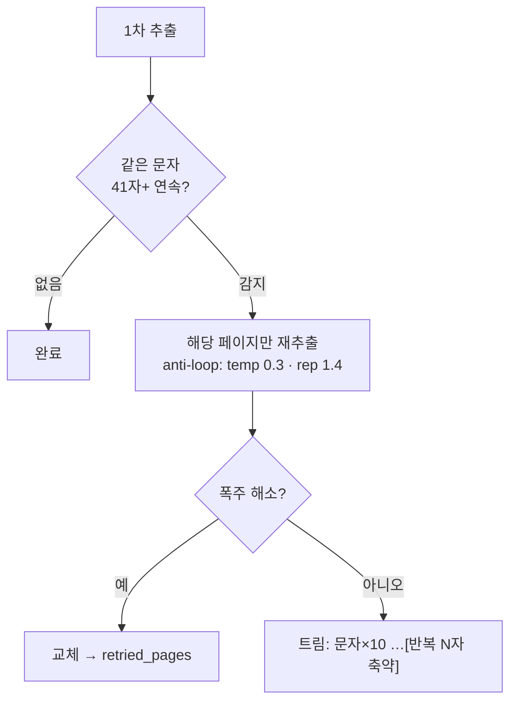
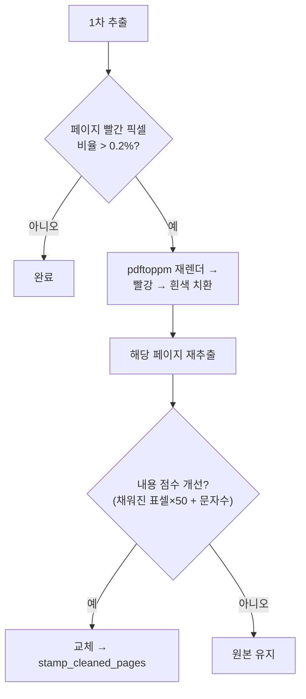

# 품질 보강 파이프라인

원본 파이프라인 위에 추가된 자동 복구 로직. 모두 **문제가 감지된 페이지에만** 적용되어 정상 문서에는 비용이 없다.

## 반복 폭주 3단 방어

특정 영역(큰 숫자·괘선·비텍스트 오인)에서 VLM이 같은 토큰(예: `0`)을 토큰 상한까지 반복 출력하는 현상(repetition degeneration) 대응.

1. **예방** — `repetition_penalty=1.15` (greedy 디코딩 유지)
2. **페이지 재추출** — 폭주 감지 시 해당 페이지만 anti-loop 파라미터로 재시도 → 응답 `retried_pages`
3. **안전망** — 그래도 남으면 축약 트림. 40자리 이하 정상 숫자는 보존

!!! success "실검증"
    126쪽 인보이스 문서에서 1개 페이지 폭주 발생 → 재추출로 약 12,000자 복구, 트림 0건, 추가 비용 +29초.

## 문서 방향 자동 보정

`PP-LCNet_x1_0_doc_ori` 분류 모델로 페이지 방향(0/90/180/270°)을 감지해 자동 회전 후 인식한다. 90도 돌아간 스캔 문서 대응. `USE_DOC_ORIENTATION=0` 으로 비활성화.

!!! warning "한계"
    **페이지 안 일부만 세로**인 텍스트(측면 라벨, 세로 스탬프, 세로쓰기 조판)는 페이지 회전으로 해결되지 않는다 — 모델 능력의 한계.

## 빨간 도장 자동 재추출

도장이 표 위에 겹치면 VLM이 해당 컬럼 값을 **통째로 누락**하는 사례가 있다 (실검증: 도장 근처 금액 셀들이 빈 값으로 추출됨).

설계 포인트:

- **내용 점수** — 단순 글자수 비교는 오판한다: 도장을 지우면 도장(그림 마크업)이 사라져 글자수가 줄기 때문. "채워진 표 셀 수"에 가중치를 줘서 *비어있던 셀이 채워졌는가* 를 본다
- **안전** — 빨간 **글자**가 지워져 내용이 줄면 원본을 유지한다
- **렌더러** — pypdfium2는 도장 안티앨리어싱을 다르게 그려 빨강 제거가 덜 먹힌다 → **pdftoppm(poppler) 우선**, pypdfium2 폴백
- 트리거 임계값은 `STAMP_RED_RATIO`(기본 0.002), 기능 전체는 `STAMP_RETRY` 로 on/off

!!! success "실검증"
    도장이 금액 컬럼에 겹친 인보이스 — 1차 추출에서 누락된 금액 3건 전부 복구 (`stamp_cleaned_pages: [1]`).

## 논블로킹 처리

- `/api/extract` 는 threadpool 에서 실행 → **문서 처리 중에도** health·웹 UI 응답 (8ms 내외)
- 파이프라인 자체는 락으로 **1건씩 직렬화** — 동시 예측으로 인한 내부 상태 충돌 방지
- 다수 문서 업로드 시 자동 큐잉: 체감 시간 = 대기 + 처리. 순수 처리시간은 응답 `elapsed_sec`

## 출력 정리

- 기본 **텍스트 전용** (`EMBED_IMAGES=0`) — 그림 태그/base64 제거, 그림 안 글자는 OCR 되어 텍스트로 포함
- 다페이지 병합 markdown 에 `<!-- page:N -->` 마커 + `## 페이지 N` 헤더 삽입 — 다운스트림에서 페이지 경계 파싱 가능
- 업로드 원본은 처리 완료/실패 시 자동 삭제 (디스크 누적 방지)
